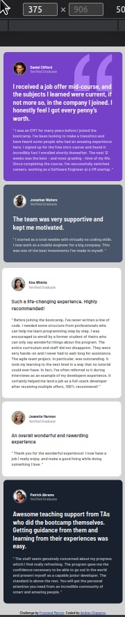

# Frontend Mentor - Testimonials grid section solution

This is a solution to the [Testimonials grid section challenge on Frontend Mentor](https://www.frontendmentor.io/challenges/testimonials-grid-section-Nnw6J7Un7). Frontend Mentor challenges help you improve your coding skills by building realistic projects. 

## Table of contents

- [Overview](#overview)
  - [The challenge](#the-challenge)
  - [Screenshot](#screenshot)
  - [Links](#links)
- [My process](#my-process)
  - [Built with](#built-with)
  - [What I learned](#what-i-learned)
  - [Continued development](#continued-development)
  - [Useful resources](#useful-resources)
- [Author](#author)
- [Acknowledgments](#acknowledgments)

**Note: Delete this note and update the table of contents based on what sections you keep.**

## Overview

### The challenge

Users should be able to:

- View the optimal layout for the site depending on their device's screen size

### Screenshot

### Links

- Solution URL: [Add solution URL here](https://t0ntin.github.io/testimonials-grid-section-main/.com)

## My process

### Built with

- Semantic HTML5 markup
- CSS custom properties
- Flexbox
- CSS Grid
- Responsive design

### What I learned

- I learned how to use grid. I had never used it before.
- I learned that I should probably design one card on HTML completely, then move on to styling that one card completely on CSS, and then completing the HTML. If I do it that way, I'm less likely to go back and forth trying to fix things.
 your own knowledge.
 - I learned to give a height to the body so content like the footer will show properly.

### Continued development

### Useful resources

I mainly used stackoverflow when I got stuck.

## Author

- Website - [Andres Chaparro](https://t0ntin.github.io/testimonials-grid-section-main/)
- Frontend Mentor - [@yourusername](https://www.frontendmentor.io/profile/t0ntin)
- Twitter - [@yourusername](https://www.twitter.com/t0ntinx)

## Acknowledgments
